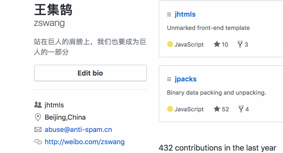

# jcameras

Mouse behavior recording and playing.

## show



* [Add to bookmarklet](https://penjs.net/element/)

## data

### long

```json
{
  "prefix": "ht",
  "version": "12",
  "session": "", // 会话标识
  "seq": 1, // 序号
  "timestamp": 12345678,
  "events": [
    {
      "type": "musemove", // 事件类型
      "path": "", // 元素路径
      "position": {
        "tx": 0.22,
        "ty": 0.33,
      },
      "time": 1234
    }
  ]
}
```

### short

* session data

name        | length | description | note
------------|--------|-------------|-------
prefix      | 2      | 数据前缀     |
version     | 1      | 数据版本     |
session     | 8      | 会话标识     |
seq         | 2      | 记录序号     |
timestamp   | 8      | 时间戳       |
events      | ...    | 事件记录     |

* event data

name        | length |  description | note
------------|--------|--------------|-----
type        | 1      | 事件类型      |
position    | 4      | 坐标位置      |
time        | 3      | 相隔时间      |
extend      | 1      | 扩展信息      |
path        | ...    | 元素路径      |